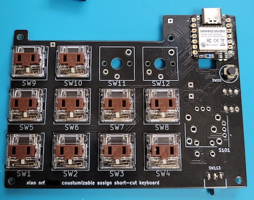

# customizable short-cut bluetooth keyboard

build enviroment : PlatformIo

# Requirement
* Visual Studio Code
* PlatfromIO

# setup
* flash program
* edit config.ini file
* connect USB to PC
* format attatched disk with FAT
* copy config.ini file to attatched disk

# pcb

# sch

# BOM
| parts    | name           | shop                                                                      | 
| -------- | -------------- | ------------------------------------------------------------------------- | 
| xiao BLE | xiao nRF52840  | https://akizukidenshi.com/catalog/g/gM-17341/                             | 
| U102     | AE-XCL103-3V3  | https://akizukidenshi.com/catalog/g/gK-16116/                             | 
| SW1-10   | A0200KL-BR-1   | https://shop.yushakobo.jp/products/pg1350?variant=44079245557991          | 
| keytop   | A0300LB-BK-10  | https://shop.yushakobo.jp/products/pg1350cap-blank?variant=37665716273313 | 
| SW20     | SS-12D01G3     | https://akizukidenshi.com/catalog/g/gP-15704/                             | 
| SW113    | TVDT18-050CB-T | https://akizukidenshi.com/catalog/g/gP-08078/                             | 
| holder   | BH-411-4A      | https://akizukidenshi.com/catalog/g/gP-03046/                             | 

---
* junichiro okabe  KYOTO, JAPAN 

* E-mail j1okabe＠gmail.com

[![CC BY-NC-SA 4.0][cc-by-nc-sa-shield]][cc-by-nc-sa]

[![CC BY-NC-SA 4.0][cc-by-nc-sa-image]][cc-by-nc-sa]

[cc-by-nc-sa]: http://creativecommons.org/licenses/by-nc-sa/4.0/
[cc-by-nc-sa-image]: https://licensebuttons.net/l/by-nc-sa/4.0/88x31.png
[cc-by-nc-sa-shield]: https://img.shields.io/badge/License-CC%20BY--NC--SA%204.0-lightgrey.svg
